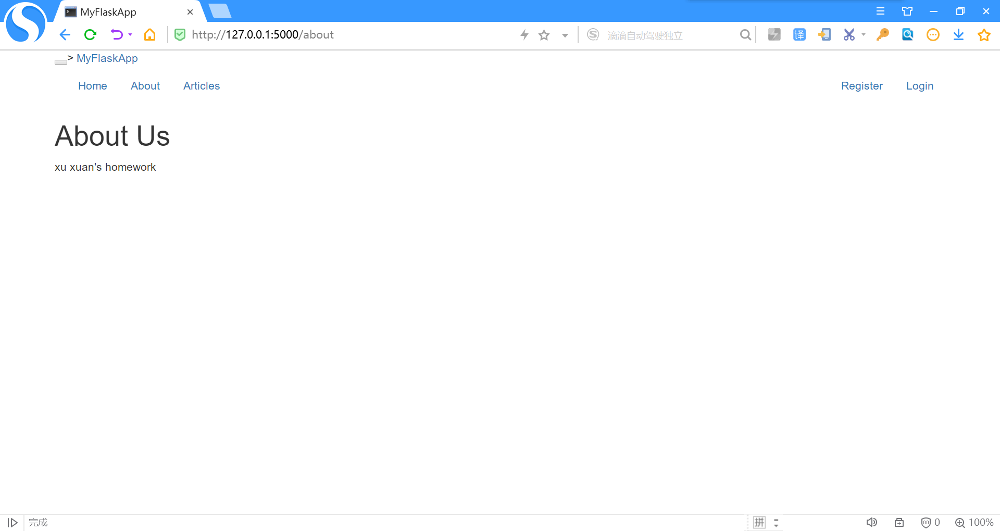
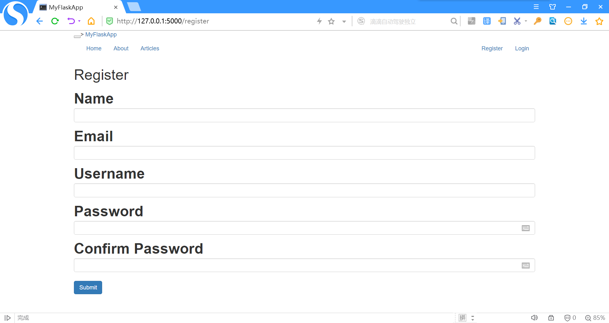

# MyFlaskApp
使用python flask微框架搭建的的简单应用程序，一共有五个页面。
# 安装
+ Python 3
+ Pip Package Manager
# 页面介绍
## 1.主页（HOME页面）

## 2.About页面

## 3.Articles页面

## 4.Register页面

注册成功后，会显示“You are now registered and can log in”。并转到login界面，见下图：

## 5.Login页面

登陆失败的界面见下图：

# 运行
+ 运行 app.py